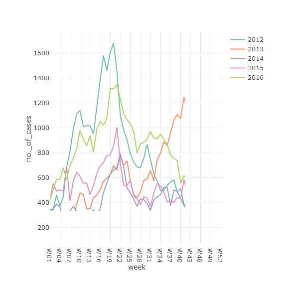

## Data

Singpapore:
https://data.gov.sg/dataset/weekly-infectious-disease-bulletin-cases

Seasonality of Hand, Fout Mouth Disease


```r
setwd("c:/shared/datasciencecoursera-slidify/deck/")
data <- read.csv("weekly-infectious-disease-bulletin-cases.csv")
library(dplyr)
library(tidyr)
hfmd <- data  %>%
        filter(disease == 'Hand, Foot Mouth Disease') %>%
        select(epi_week, no._of_cases) %>%
        separate(epi_week, c('year','week'), sep='-')
```

--- .class #id 

## Slide 2




