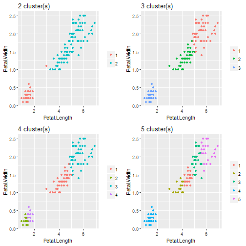
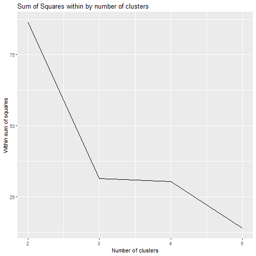

## K-Means clustering

When looking at uncategorised data, it can be useful to group similar observations together

K-Means clustering allows us to do just that

But finding the 'right' number of clusters can be a little tricky


## The app (1)

The Shiny app enables the user to select a range of clusters, e.g. between 2 and 5, and run K-Means for each sample size (`2,3,4,5` in that case)

The output will be 2 graphs - one to visualise the clustering when plotting petal length vs petal width:


```
## Error in library(gglpot2): there is no package called 'gglpot2'
```



## The app (2)

And another showing the total sum of squares within for each value of `k`:



We will be using the `iris` dataset as an example (which happens to be categorised, so we know what the correct number of clusters should be)

## Thanks

<center>
That's all!
</center>
